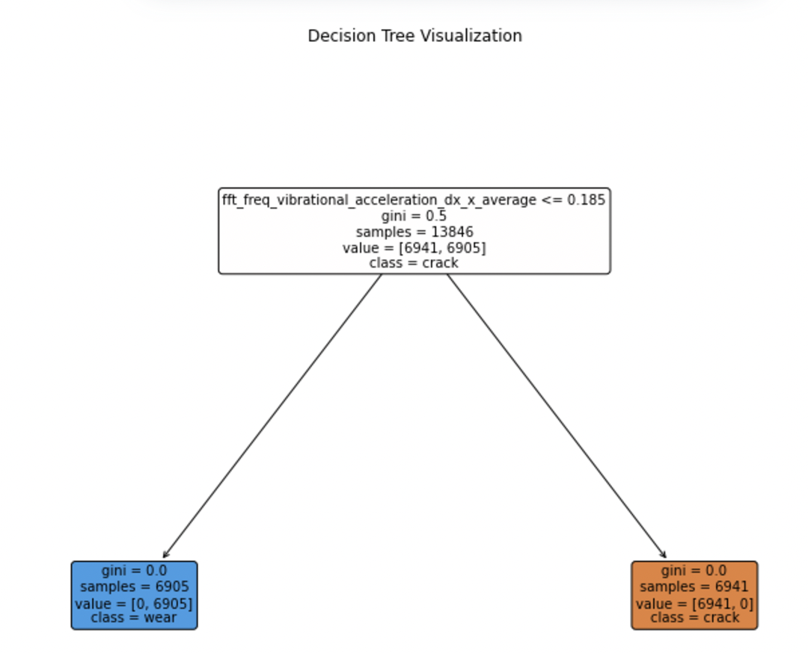

# Railway Wheelset Transversal Axle Crack Investigation from Axle-Box Signals

## Business Problem Statement

The task was to identify differences between healthy and defective axle in a wheelset based on velocity and defect severity. Additionally, the goal was to determine if we could distinguish between the presence of a crack and the wear phenomenon of the wheel arising from increasing kilometers traveled. 

 

### Analytics Problem Statement

1. Classify axles into two categories:
   - **Cracked**: Axles with a crack of varying severity.
   - **Worn Down**: Axles experiencing wear from extended usage.

2. Determine the intensity of wear or crack based on the provided data.

---

## Data Description

The dataset comprised axle-box accelerations recorded during experimental tests on a wheelset installed on the test bench. The wheelset was tested under conditions replicating real-world train operation, including:
- Speeds of **100 km/h**, **200 km/h**, and **300 km/h**.
- Applied loads to simulate running conditions.
- Artificially reproduced axle cracks of increasing severity (**Crack70**, **Crack81**, **Crack91**).
- Data for healthy axles subjected to wear over time (**WearB8**, **WearB4**, **WearB13**).

### Key Features

- **Defect Type**: Crack or wear (e.g., `Crack70`, `WearB8`).
- **Dimension**: Crack length.
- **Distance**: Distance traveled by the wheelset in kilometers.
- **Speed**: Wheelset velocity (100, 200, or 300 km/h).
- **Sampling Frequency**: Fixed at 6400 samples/second.
- **Vibrational Acceleration**:
  - **x_dx**, **y_dx**, **z_dx**: Vibrational acceleration along the x, y, and z axes on the non-defective side.
  - **x_sx**, **y_sx**, **z_sx**: Vibrational acceleration along the x, y, and z axes on the defective side.

### Data Structure

The dataset files followed the structure:  
`defectname_velocity_defectlength-date.txt`.

---

## Data Preprocessing

1. **Duplicate Removal**: Duplicate rows were removed.
2. **Missing Values**: No missing values were found.
3. **Feature Dropping**: 
   - The sampling frequency column (constant at 6400) was dropped.
   - Wheel radius was fixed at **0.00046 m**.
4. **Block Sampling**: 
   - The dataset contained approximately **17,280,000 rows per class**, making direct processing computationally intensive.
   - To preserve cyclicity, block sampling was performed based on the wheel's rotation time at **100 km/h**. 
   - **Block Size**: 665 rows represented data collected during one rotation at 100 km/h.
   - Final dataset size after sampling: **5,755,273 rows** per class.

---

## Exploratory Data Analysis (EDA)

1. **Vibrational Acceleration Analysis**:
   - Non-defective side: Highest acceleration along the **z-axis**.
   -  
   - Defective side: Negative acceleration observed along the **y-axis**.
   -  
   
2. **FFT of Vibrational Acceleration Frequencies**:
   - Fast Fourier Transform (FFT) was used to analyze vibrational acceleration.
   -  
   - Peaks in the amplitude spectrum provided insights into dominant vibrational patterns.

3. **Correlation Analysis**:
   -  
   - No significant correlations were observed in the heatmap.

---

## Feature Engineering

1. **Block Transformation**:
   - For each block (one rotation, size 665), calculated:
     - **Minimum**, **maximum**, **average**, and **standard deviation** of vibrational acceleration across x, y, z axes.
     - **FFT frequency** metrics for each axis.

2. Result: Each block of size 665 was reduced to a single row summarizing these statistics, ensuring efficient computation.

---

## Model Building

### Crack vs. Wear Classification

1. **Data Splitting**:
   - **Training**: 80%
   - **Testing**: 20%

2. **Cross-Validation**:
   - Performed with **k=5** (5-fold cross-validation).

3. **Model**:
   - **Decision Tree Classifier**:
     - Achieved **99.99% accuracy** using the feature: 
       - `fft_freq_vibrational_acceleration_dx_x_average` (average FFT frequency along the x-axis of the non-defective side across one rotation).
     -  
     - Threshold: If `fft_freq_vibrational_acceleration_dx_x_average < 0.185`, it indicated **wear**; otherwise, it indicated **crack**.

4. **Insights**:
   - Axles with cracks exhibit a higher average FFT frequency (>0.185) than worn axles.

### Defect Severity Classification

1. **Wear Dataset**:
   - Decision Tree with pre-pruning `min_samples_split=100` and `min_samples_leaf=100`.
   - Achieved **96.77% accuracy**.
   -  
   - Important Features:
     - The following features were identified as the most significant for classifying the severity of wear in the dataset:

      | Feature        | Importance Score |
      |----------------|------------------|
      | `z_dx_std_dev` | **0.3492**       |
      | `y_dx_std_dev` | **0.1646**       |
      | `y_sx_std_dev` | **0.1629**       |
      | `Velocity`     | **0.1358**       |
      | `x_sx_std_dev` | **0.1153**       |
     -  

2. **Crack Dataset**:
   - Decision Tree with pre-pruning `min_samples_split=100` and `min_samples_leaf=100`.
   - Achieved **70.07% accuracy**.
   -  
   - The following features were identified as the most significant for classifying the severity of cracks in the dataset:

      | Feature        | Importance Score |
      |----------------|------------------|
      | `x_sx_std_dev` | **0.5429**       |
      | `y_sx_std_dev` | **0.3383**       |
      | `z_sx_std_dev` | **0.0946**       |
      | `x_dx_std_dev` | **0.0233**       |
      | `z_dx_std_dev` | **0.0009**       |
   -  

   - Challenges:
     - Overlaps in characteristics between crack severity classes (e.g., **Crack70**, **Crack81**, **Crack91**) reduced accuracy.
     - Variability due to different states of **compression** and **traction**.
       
---

## Results

- **Crack vs. Wear Classification**: Achieved 99% accuracy.
- **Defect Severity Classification**:
  - Wear: 96.77% accuracy.
  - Crack: 70.07% accuracy.
- Key Insight: Axles with cracks exhibit higher vibrational acceleration and FFT frequency compared to worn axles.

---

## Future Scope

1. Extend the analysis to incorporate the **crack breathing mechanism**, which models the states of compression and traction. 
2. This could improve classification accuracy between different crack severities by accounting for additional physical phenomena.

